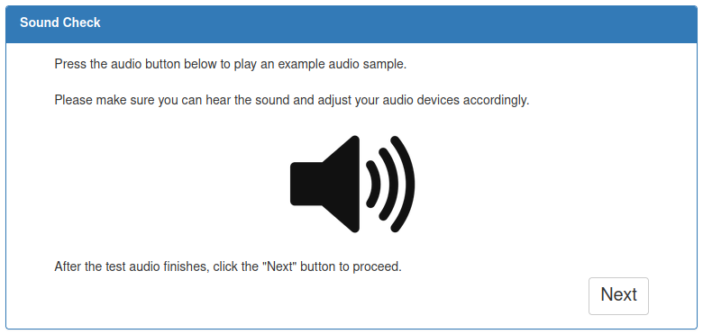

# Audio

## HTML
```html
<audio id="exp1_full_experiment_audio"></audio>

<div class="panel-body">
    Press the audio button below to play an example audio sample. <br><br>
    Please make sure you can hear the sound and adjust your audio devices accordingly.
    <div id="audio-test-button" style="margin:auto;display:block" disabled>
        
    </div>
    After the test audio finishes, click the "Next" button to proceed.
    <button id="audio-test-next" ng-click="RC.next()" type="button" class="btn btn-default" style="display:none">
        Next
    </button>
</div>
```



## JS
General Ideas:
```js
// creating audio and playing it through JS 
const audio = new Audio("/dynamicAssets/audios/Experiments/my_audio.mp3");
audio.play()

// providing audio to an HTML element
let full_experiment_audio = document.getElementById('exp1_audio');
full_experiment_audio.src = "/dynamicAssets/audios/" + self.audio_stream_fpath;
full_experiment_audio.play();
```

Example function to let user test audio by pressing a button.
```js
// function is called in the HTML
this.soundCheck = function () {
    const audio = new Audio(
        "/dynamicAssets/audios/Experiments/SLTaskSICRExperiment/" + 'audio-test.mp3'
    );
    const audio_test_button = document.getElementById("audio-test-button");
    const next_button = document.getElementById("audio-test-next");

    // on click, disable the button and play the audio
    audio_test_button.addEventListener("click", () => {
        if(!audio_test_button.disabled){
            audio_test_button.disabled = true;
            audio.play();
            next_button.disabled = true;
        }
    });

    // once audio is over, re-enable the button to start audio
    audio.onended = function () {
        audio_test_button.disabled = false;
        next_button.disabled = false;
        next_button.style.display = "block";
    }
};
```