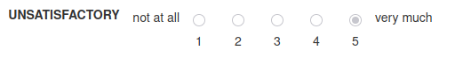

# Likert Scale

## HTML
```html
<div class="likert">
    <div class="colname">
      <label><b>UNSATISFACTORY</b></label>
    </div>
    <label class="start-label">not at all</label>
    
    <div class="likert-radio-group" ng-repeat="i in [1,2,3,4,5]">
      <input
        type="radio"
        id="selection{{i}}"
        name="q5"
        ng-checked="i === 5"
        disabled
        value="{{i}}"
        required
      />
      <label for="selection{{i}}">{{i}}</label>
    </div>
    
    <label class="end-label">very much</label>
</div>
```




## CSS
```css
.likert {
    display: flex;
    align-items: center;
    margin: 10px 0;
    position: relative;
    font-weight: 500;
}

.likert label {
    font-weight: normal;
}

.colname {
    margin-bottom: 4rem;
    width: 10em
}

.likert label.start-label,
.likert label.end-label {
    margin-bottom: 4rem;
}
.likert-radio-group {
    display: flex;
    flex-direction: column;
    align-items: center;
}

.likert-radio-group input[type="radio"] {
    margin: 0 15px;
    position: relative;
    top: -3px;
    /* Adjusts the vertical alignment */
}

.likert-radio-group label {
    margin-top: 5px;
    /* Space between radio button and its label */
}
```
