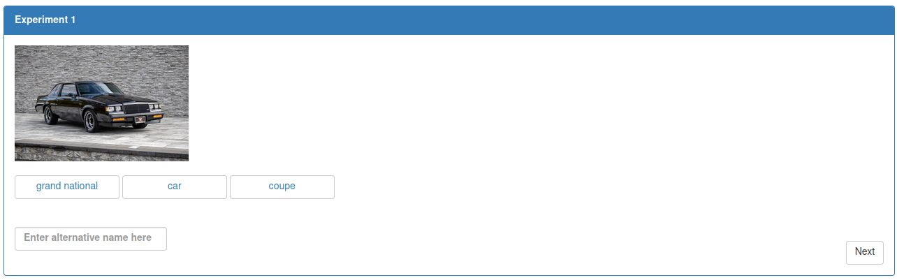

# Code Walkthrough Introduction

This section is divided into two parts. 
The first part is a very quick introduction to web design concepts
as well as a general overview of the code that Lingoturk uses to run
experiments. 
The second part puts that information to practice through
a follow along tutorial that will build a working experiment from scratch.

# 1. Code Overview
1. [The Very Basics of Web Design](./overview/01-Basic-Overview.md)
2. [Quick Code Rundown](./overview/02-Code-Rundown.md)
3. [Experiment Slide Structure](./overview/03-slide-structure.md)

# 2. Experiment Tutorial
We will start with an empty experiment type and work it into an example
experiment, by following along, you'll get experience working with Lingoturk
and have a working experiment at the end. 

If this is your first time working
with web design, it'll be a good hands on experience.
Each section, we'll add one thing to the experiment until, by the end, 
we will have a working project that is able to submit responses to your
local Lingoturk server's database.

### Planned Experiment
This tutorial will build a experiment type from scratch. The experiment will
consist of a simple task. It takes about an hour to read through and follow
along. The tutorial aims to provide an idea of how development on Lingoturk works. 

The final created experiment will be a simple forced choice image naming task
with an option for participants to provide an alternative through a textbox. 
This is what it will look like:

For anyone new to web development, the tutorial will cover how Angular manages 
data and how that data is presented to the users.

The final JS, HTML, and CSS files are available [here](data/finished-files) for reference.

### Table of Contents
1. [Prerequisites](./steps/00-setup-prereq.md)
2. [Adding Slides](./steps/01-adding-slides.md)
3. [Adding Instructions](./steps/02-adding-instructions.md)
4. [Preprocessing the Data](steps/03-data-preprocessing.md)
5. Experiment Creation
   - [Creating UI Elements](steps/04-adding-exp1-ui-elements.md)
   - [Adding Functionality](steps/05-adding-exp1-functionality.md)
   - [Saving Responses](steps/06-saving-exp1-responses.md)
