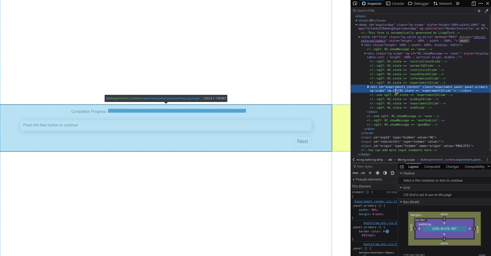

# Quick Code Rundown

This section will quickly go high level over the HTML and JS files and point out
anything that you should know to start programming immediately after.

> Any additional notes, especially written for anyone who has never done web
> or front-end dev before will be written in these bars

## HTML 

LingoTurk experiments run everything on a single webpage, so only a single HTML
file exists per experiment. Every single "view" that the participant needs to
see on a web page will be pre-defined in this document. Depending on the logic
of the code and the Angular "ng-" built in directives, the web page will update
automatically to show the participants different materials or instructions.

> Even if you don't see it reflected on the webpage, the HTML still exists. 
> If you were to view the document source for an experiment, you can see
> all the HTML code there.



In this example, the \<div> is higlighted and displayed because its
Angular ng-if directive of "RC.state==..." is fulfilled. However, there are 
multiple visible green commented out lines with other if statement. The
HTML that correspond to these directives will only be displayed when 
their conditions are fulfilled.


## JavaScript

> You will come across the $ (dollar sign) a lot in JS.
> It's most likely used with jQuery (a very popular JS library) 
> as a way to quickly find an element in the DOM tree 

### $(document).ready()

The $(document).ready() call is pretty much the same as a main() function in Python
or Java. "Ready" here indicates when the webpage is safe to be manipulated. JQuery 
handles the safety check for you with this call.

```javascript
$(document).ready(function () {
    ...
}
```

Everything inside the ready() function occurs once the webpage is loaded. 
Things of note in here:

1. `self.load()`: this.load() most importantly populates self.questions
2. `self.allStates`: these represent the different "Slides" that are in your experiment.
You will need to add to this list as you create different pages that need to be
shown to the participants.

### this.next() & this.nextQuestion()

These two functions control the flow of content presented to the participant. 
Both functions can be called at any time in the JS code or through Angular directives
in the HTML file.

`next()` moves between slides while `nextQuestion()` moves between questions.
If all questions have been iterated through, `nextQuestion()` will also call
`next()` automatically. 


For example, this button defined in the HTML will advance to the next question when 
clicked. When the last question has been displayed, this button will also advance
to the next state in `self.allStates` when clicked using an Angular directive.
```html
 <button id="next-button" ng-click="RC.nextQuestion()" type="button">Next</button>
```

Instead of using HTML, this functionality can be accomplished with JS only. 
Here, use jQuery to locate an element with ID "next-button" and add a click event.

```javascript
$("#next-button").on("click", self.nextQuestion())
```

> Delete the ng-click directive and add this line anywhere in the .js file
> outside the .ready() call to see it in action.

Another important thing to note in this.next() is the condition for submission.
The starter logic keeps track of the index of the slide we are currently displaying
with `self.slideIndex`. Once slideIndex is equal to the length of `self.allStates`, 
i.e. we are finished with all the slides, then we begin the submission process.

> JS uses "this.functionName" to define functions. But it's called with
> "self.functionName" - I will use both notations interchangeably.

### self.submitResults()

This call itself starts a chain of logic and further calls that will get you closer
to the submission page. Taking a look at the HTMl, the div for submission only shows
up for a `RC.showMessage == 'goodBye'` condition. 

```html
 <div ng-if="RC.showMessage == 'goodBye'" style="...">
```

> I'm not actually show what "RC" stands for - but you can think of it as
> a way to access variables and functions that are defined in the code.

That variable only changes when self.submitResults() calls self.resultsSubmitted(), 
which in turn calls self.processFinish(). Once this variable is set, the submission
page finally shows up. 

And if you note the HTML for the Submission button, the submission is done by
the finished() function - which holds all the logic for 

```html
<button ng-click="RC.finished()" class="btn btn-default" type="button">Submit</button>
```

## Summary

This should give you a really quick overview of the most important parts of 
the starter code. 

I won't go over the CSS because this documentation will only cover the logic
of the code. CSS is a cosmetic step to be done after the experiment is already
near completion. 
