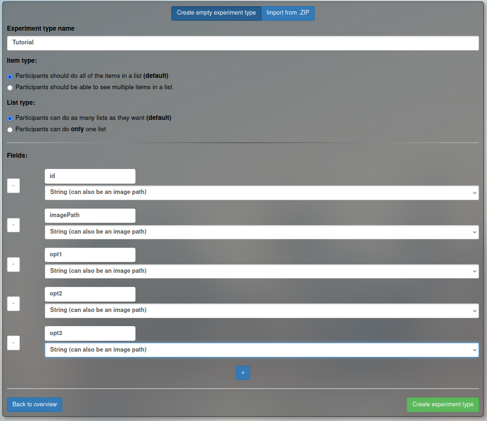

### Prerequisites
You will need:
- the local copy of the Lingoturk repository, cloned from
  https://github.com/FlorianPusse/Lingoturk.
- fully set up pgadmin and Lingoturk backend
- an IDE of some sort (IntelliJ offers education licenses for free)
- basic understanding of Lingoturk (see: [Lingoturk Introduction](../lingoturk_introduction/README.md))

Create an experiment type called `Tutorial` that has five
fields. We will use this for the code walkthrough.
- id (String)
- imagePath (String)
- opt1 (String)
- opt2 (String)
- opt3 (String)

Then create an experiment instance with [this CSV file](tutorial.csv).

--- 

Continue to [Adding Slides](01-adding-slides.md)
