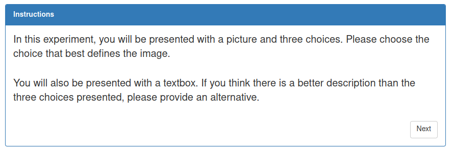

# Adding Instructions

As tested in the previous section, the experiment instance functions and is able
to iterate through a number of pages, but it does not work as expected.

The goal of this section is to make the instructions page look like this 
and making sure it only appears a single time:



**Table of Contents**
1. [Instruction Page Changes](#instruction-page-changes)
2. [Testing the HTML](#testing-the-html)
3. [Common Errors](#common-errors)


## Instruction Page Changes

Make the following changes:
1. Replace the text "INSTRUCTIONS HERE" with "INSTRUCTIONS"
> Note the class `panel-heading`, use a `div` with this class to create headers
> for slides. The other classes `panel` and `panel-primary` are used to create
> the panels that hold all the other elements. If those are not present, the boxes 
> will not appear on the screen.

2. Remove all child element IDs - optional, but since they will never be referenced, good practice to remove
3. Update ng-click in the Button to call `self.next()` instead of `self.nextQuestion()`
> self.nextQuestion iterates through all the questions (rows of the CSV file).
> in order to get the intended behavior for an instruction page, the function
> assigned to button click is updated to `next()` which advances the experiment
> to the next slide.

4. Remove ` && RC.questionIndex == $index` from the ng-if logic.
5. Remove `ng-repeat="question in RC.questions"` from the div definition.
> Removing these two pieces of ng logic is not strictly necessary because the button 
> call has been updated to move on click to the next slide, but it is a good idea 
> to clean up the code to avoid potential problems.

6. Replace `{{question}}` with paragraph tags with the instructions inside \<p> like this \</p>

> Since the instructions are not usually dynamically
> updated, all of this information can be hardcoded
> into the HTML.

Here is what the `experiment1_instruction` div should look like 
(with all the comments removed): 

```html
<div id="experiment_instructions" ng-if="RC.state == 'experimentInstructionSlide'" style="width:90%; margin:auto">
    <div class="panel panel-primary">
        <div class="panel-heading" style="font-weight: bolder">INSTRUCTIONS</div>
        <div class="panel-body">
            <p style="font-size: 20px">
                In this experiment, you will be presented with a picture and three choices.
                Please choose the choice that best defines the image.

                <br>
                <br>

                You will also be presented with a textbox. If you think there is a better description
                than the three choices presented, please provide an alternative.
            </p>
            <button ng-click="RC.next()" type="button" class="btn btn-default" style="float:right ; margin-top:20px">Next</button>
        </div>
    </div>
</div>
```

> `<br>` is short for "break" are represents a newline or a line break. Use it to 
> quickly space lines of text. 

## Testing the HTML

Before refreshing the page to see the new changes, go to the JavaScript file 
and comment out the experiment content slide. This way, only the 
instruction slide will be shown after entering the workerID. Like this:

```js
self.allStates = [
    "instructionsSlide",
    "workerIdSlide",
    "statisticsSlide",
    "experimentInstructionSlide",
    // "questionSlide"
];
```

When developing locally, this is a good way to quickly test changes on specific
slides without having to do large portions of the experiment. 

Hopefully at this point, the instruction page is displayed properly, and
on clicking the "Next" button, the experiment displays the submission page. 
You have successfully set up a working slide! Before working on the question slide
itself, the next section will go over any data preprocessing steps that may 
need to occur first. 

## Common Errors

- Make sure that all the tags in the HTML file have end tags if they need them. 
If all the elements are on screen at once, 
it is likely caused by a mismatched tag somewhere in the HTML file.

- Make sure that IDs in each `div` is correctly named
and that the ng-init logic is correct.

---

Continue to [Data Preprocessing](03-data-preprocessing.md)  
