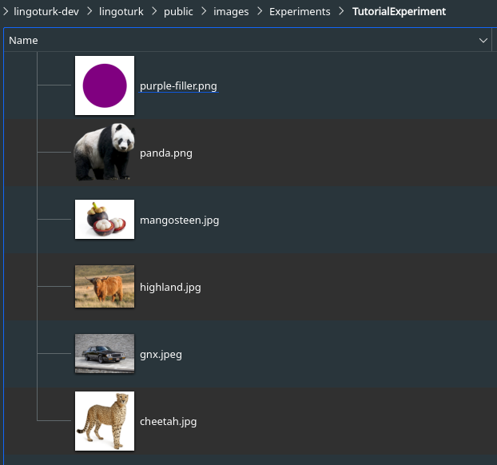

# Data Preprocessing

Data Processing is highly dependent on the experimental setup and the CSV files
used by each study. Thankfully, for the tutorial, very little work is required. 

**Table of Contents**
1. [Removing CSV Headers](#removing-csv-headers)
2. [Moving Pictures](#moving-pictures)

---

## Removing CSV Headers

The provided CSV file in this tutorial contains headers for each of the columns.
The starter JS code does not handle this, so one of the first updates must be to 
remove it before continuing.

In the code, locate the `this.load` function. This is where most data preprocessing
steps will be completed. 
At the moment, the most important line in the `load` function 
is `self.questions` getting assigned data. 

> Note: the `load` function is split into (if-elseif-else), three different branches. 
> This represents all the
> different ways data could be loaded (across different platforms). Make sure that any
> data loading changes are applied to all the branches.

After `self.questions` is assigned a value, add a 
line of code to remove the header. Make sure to do this for all three ways
the data may get loaded.

```js
self.questions = ...
self.questions.shift(); // drop header
```

This list is then shuffled by default in most cases. Turn this off by setting the 
`self.shuffleQuestions` variable to false in the JS file.

---

## Moving Pictures

This experiment involves images - this is a good time to place the images where
they need to go. Copy the provided images from [this link](../data/images) into the 
proper location under the `public/images/TutorialExperiment/` folder.

Here is what the path and folder of images should look like once completed: 



---

At this point, we can move on to creating the experiment proper.

Continue to [Creating Experiment UI Elements](04-adding-exp1-ui-elements.md)
