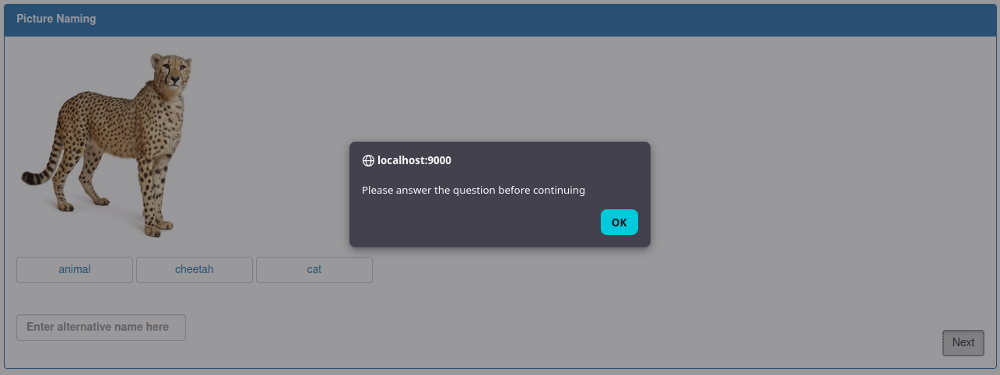
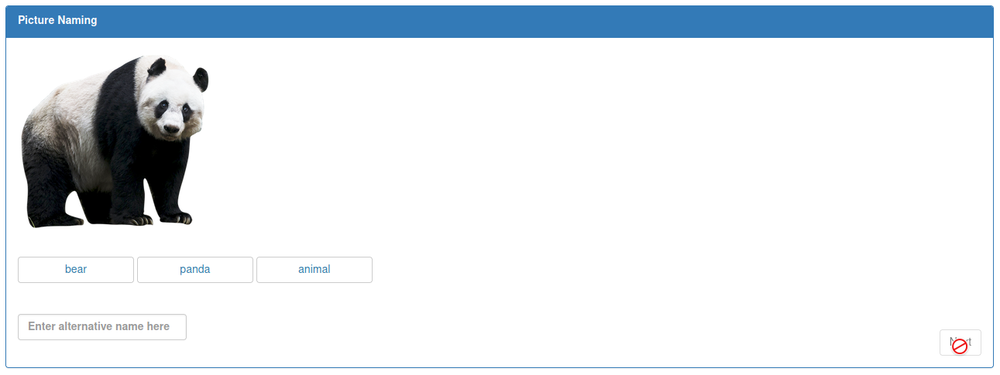

# Adding Experiment Functionality 

**Table of Contents**
1. [Button Functionality](#button-functionality)
2. [Force a Selection](#force-a-selection)

---

## Button Functionality

Create a function called `confirmSelect` in the JS that will be called from the HTML with a ng-directive.
This function adds a class called `selected` to the selected button and removes the 
same class from the other two buttons on the page.

> `$("#" + opt)` is a JQuery request for an element on the webpage. 
> In this case, the `"#"` looks for an element with an ID. 
> The ID which is provided through the concated variable `opt`.

```js
this.confirmSelect = function (selectedOpt) {
    // the 3 options created in the HTML
    let opts = ["opt1", "opt2", "opt3"]
    
    for (const opt of opts) {
        if (opt !== selectedOpt) {
            $("#" + opt).removeClass("selected")
        } else {
            $("#" + opt).addClass("selected")
        }
    }
}
```

Before changing the HTML, update the CSS file to add a background color 
to any UI element with the two classes `btn` and `selected`. This `selected` 
class is the one the `confirmSelect` function adds to the
selected button. The `btn` is defined upon creation in the HTML.

```css
.btn.selected {
    background-color: lightblue;
}
```

> NOTE: chain classes or element types to get very specific CSS selectors.

Add the `ng-click` directive to each button's definition, providing it with the
previously defined function and an argument that corresponds to the button. 
In this example, `opt2` is passed in as the argument because this is the second button.

> be careful with single and double quotes when passing arguments

```html
<button id="opt2" ... ng-click="RC.confirmSelect('opt2')">
    {{question.opt2}}
</button>
```

<details>
<summary>
Refresh the instance and check that the buttons change colors when selected.
</summary>
    <image src="../images/exp1-blue-selection.png"></image>
</details>

---

## Force a Selection

By default, clicking on the "Next" button will trigger `nextQuestion` no matter what. 
In order to force a selection before moving on to the next question, check to see
if a button has been selected by modifying the `nextQuestion` function.

Since a `selected` class is added to a selected button, one way to do this is to
check for the existance of a button with the `selected` class.
By doing this inside a try-catch block, if an error is thrown, then no selection
was made. The call `document.querySelector()` returns a list of elements. By attempting to access
the 0th item in this list, the try-catch will only succeed if a button is actually
selected.

```js
this.nextQuestion = function(blockNumber=1) {
    try {
        document.querySelector(".fcButtons.selected")[0]
    } catch {
        alert("Please answer the question before continuing");
        return;
    }
    
    // ...
}
```

If no selection was made, then it is a good idea to alert the participant
that they must answer the question before continuing.



### Alternative

Instead of the Next button being enabled all the time despite not making a 
selection, another option is to disable the button until a condition is met by
using  the `ng-disabled` directive.

Update the button definition by adding logic to enable the button only
when the current question has an response in the answer field:

```html
<button  ng-disabled="question.answer === undefined || question.answer === '' || question.answer == {}" ...>
```

Refreshing the page, the `Next` button on the first trial will not be enabled.
The participant cannot advance until the answer field is filled.
Only once this field
is non-null will the button be enabled and the participant can move onto the
next question.



At the moment, this functionality has not been programmed. Therefore, this temporarily
breaks the experiment. However, how to update the `answer` filed will be covered in
the next section on saving responses.

---

At this point, the UI and all the elements on the page should be interactable.
It is possible to run through the entire experiment. The only step remaining
is to save the responses.

**Continue to [Saving Experiment Responses](06-saving-exp1-responses.md)**
