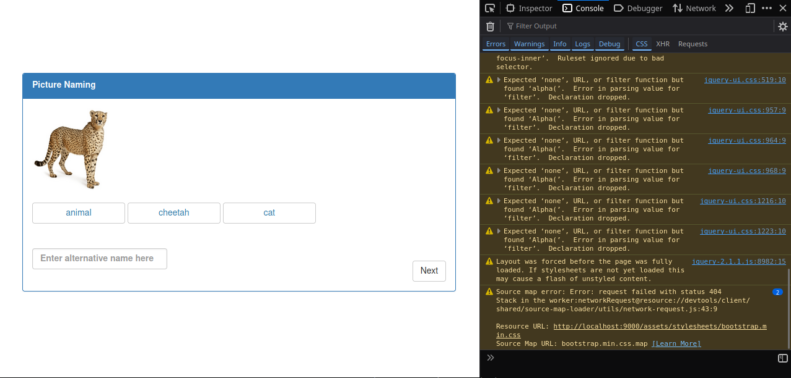
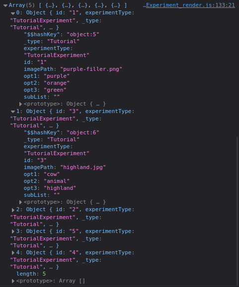
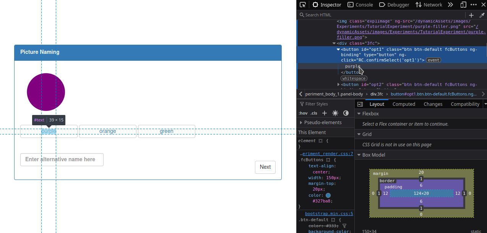
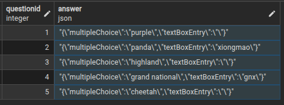

# Saving Experiment Responses

## Console Logging

To make sure that the answers are being read correctly, this section will add 
`console.log()` commands. These are the JS equivalent to the `print` commands from other
languages. 

In order to see these logs in the browser, open up the console by pressing the `F12`
key on both Firefox or Chrome. For other browsers, it's likely the same key. If not,
it should be easily pulled up by right clicking on the page and selecting "Inspect". 

Here is what the console looks like in Firefox:



---

## self.questions & Result Submission

This variable is actually a slight misnomer - because it doesn't only hold the questions.
When saving participant responses, this is the variable those answers are added to. 

Now is a good time to `console.log()` this variable to see what it looks like. A 
good place to put this call is in the `self.next()` function to output the
questions after pressing the `Next` button on the main instruction page.

```js
this.next = function(){
    ...

    console.log(self.questions)
};
```

With the provided CSV file, `self.questions` looks like this:



There are 5 questions, which correspond to the 5 data rows in the CSV. 
The dictionary in each object is how items are stored. In the previous
sections whenever Angular interpolations were used (e.g. `{{question.opt1}}`),
the items in each of these dictionaries is where the information was retrieved.
The dictionary can be modified at any point. Keys can be added, meaning 
responses can be stored in each dictionary by adding an "answer" key containing
the response.

Locate the `this.submitResults` function. This function is called by clicking the 
`Next` button on the submission slide. Inside the `results` variable is 
`self.questions`. This entire variable is posted and sent to the database, saving the
results!

---

## Gathering Responses

In general, saving responses looks like this in the JS file:

```js
self.questions[self.questionIndex].answer = participantResponse
```

This line of code acesses a question from the list of questions, creates
or updates a field called `answer` with the participant response. The process to 
access that response will be different depending on what kind of task and what
elements the task consists of.

If there are multiple recorded responses per question, 
all of the responses still need to be saved to the `answer` field. 
This one field always exists in the backend database and is reserved for
saving responses. Thankfully, it is possible to save key-maps and lists.

The tutorial task has two potential responses, the multiple choice and an optional
text response, it's a good idea to use a map to save the results.
The code to save the map of responses like this: 

```js
self.questions[self.questionIndex].answer = {
    multipleChoice: multipleChoiceSelection,
    altName: textBoxEntry
}
```

---

## Multiple Choice Response

Take a look at the Inspector for each of the buttons. For example, here, the choice for
"purple" has the text directly inside the `<button>` element. 



Remember that when a button is selected, it is assigned the class `selected`. This class
is also removed from the two other buttons. Therefore, to get the response, 
look for a button with the class selected, and grab the text inside it.

This action should occur whenever the `Next` button is clicked. But only after a check
for the selection has occurred. Meaning this resides in the `nextQuestion` function.
The code to do this looks like this:

```js
$(".fcButtons.selected").innerText
```

> `innerText` provides a textual/string output of all of an element's descendents, i.e.
> returns everything inside the elemnt in their string form. 
> 
> If you want to get the HTML of all the descedents, use `innerHTML`.
 
Log the results and check if the output is correct when clicking the `Next` button.
```js
this.nextQuestion = function(){
    // try-catch block

    console.log($(".fcButtons.selected")[0].innerText)

    // questionIndex incrementation
};
```

To save the response, replace the `console.log` call with:
```js
self.questions[self.questionIndex].answer = $(".fcButtons.selected")[0].innerText

// use console.log() call to check it worked
console.log(self.questions[self.questionIndex].answer)
```

### Alternative

Instead of saving the response on the press of the `Next` button, it is possible
to save the response every time on the multiple choice button instead. 
This is a viable alternative for most interactive tasks. However, if the forced
choice is managed by `ng-disabled`, then the `Next` button is disabled and cannot
be used to save responses, therefore this method must be utilized. 

Each multiple choice button calls the `confirmSelect` function on click. A parameter
identifying the which button was selected is passed to this function. Use this parameter
to find which of the three words was selected and save it to the question map:

```js
// create the answer map if it does not exist yet
if (self.questions[self.questionIndex]["answer"] === undefined) {
    self.questions[self.questionIndex]["answer"] = {}
}

// save the selected response to a key called "multipleChoice"
self.questions[self.questionIndex]["answer"]["multipleChoice"] = self.questions[self.questionIndex][selectedOpt]
```

At this point, the button will be enabled because the `answer` field has a value,
allowing the participant to continue on to the next question.

---

## Text Box Entry Response

Text box entries are very straight forward: use the ID of the textbox 
to find the element. Then access the element's value to view what was typed
into the textbox.

The ID for the text box defined earlier in this tutorial is `altNameInput`.
Inside the `nextQuestion` function, save the value of this element. Combined with
the multiple choice selection, the `answer` field becomes a map, and looks like
this:

```js
self.questions[self.questionIndex].answer = {
    multipleChoice: $(".fcButtons.selected")[0].innerText,
    textBoxEntry: document.getElementById('altNameInput').value
}
// use console.log() call to check it worked
console.log(self.questions[self.questionIndex].answer)
```

--- 

## Check Results

The experiment is finished! Run through the experiment and query the results.
For each question, there should be a corresponding `answer` field which looks like
this:


