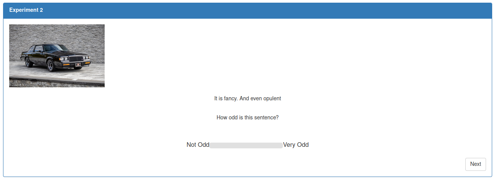
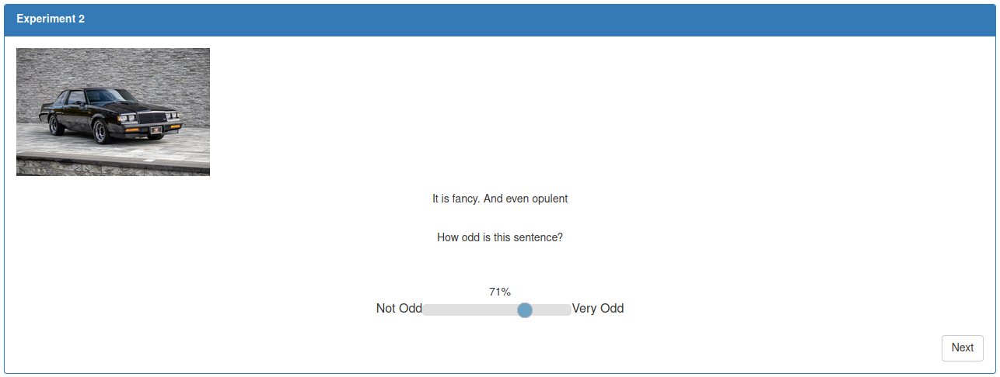
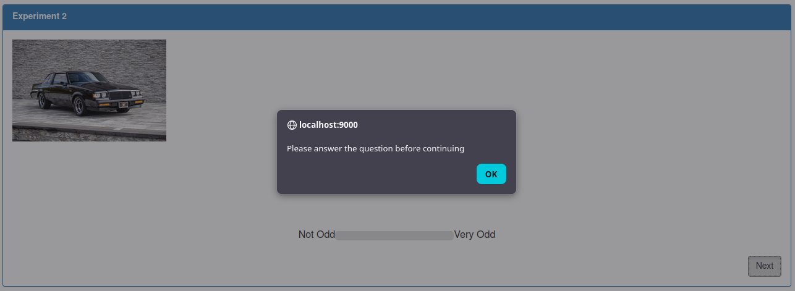

# Adding Experiment 2 Functionality

**Table of Contents**
1. [Setup](#setup)
2. [Updating Image Source](#updating-image-source)
3. [Adding Text to Paragraphs](#adding-text-to-paragraphs)
4. [Basic Slider Logic](#basic-slider-logic)
5. [Force a Slider Response](#force-a-slider-response)
   - [Modifying the Slider](#modifying-the-slider)
   - [Modifying the Next Button](#modifying-the-next-button)

---

## Setup

To start, there one NG-directive needs to be added.
In the `experiment2_content` div which holds all the content that defines the
UI the participants will see, there exists both an `ng-if` and `ng-repeat` 
directive. 

Add another `ng-init` directive that calls a function `experimentTwo`. 
This is what the div definition should look like:

```html
<div id="experiment2_content" ng-if="RC.state == 'experiment2_content' && RC.block2QuestionIndex == $index" ng-repeat="_ in RC.questions_block2"  ng-init="RC.experimentTwo()" style="width:90%; margin:auto">
```

In the JS file, define a new function called `experimentTwo`. This could be called 
anything, but just make sure it matches the function used by the above `ng-init`. 

This new function will run immediately upon the activation of this div. All
the logic that needs to happen with the elements will fall inside this function. 
All control over question index will still go through `ng-if` and `ng-repeat`.

> Remember that JS is asynchronous, i.e. it doesn't have to execute code from top
> down. So don't worry about a for loop holding up the EventListeners. 

---

## Updating Image Source

In the `experimentTwo` function, add these lines to use jQuery to update the
src attribute on the image element.

```js
const question = self.questions_block2[self.block2QuestionIndex]
const fullImgPath = "/dynamicAssets/images/Experiments/TutorialExperimentExperiment/" + question["imagePath"]
$("#experiment2image").attr("src", fullImgPath)
```

---

## Adding Text to Paragraphs

Here is another way to set an attribute without using jQuery. 
Find the two elements that correspond to the Sentence and the Question.
Then set the `innerText` attribute to the appropriate text.  

```js
const sentenceElement = document.getElementById("scaleSentence")
const questionElement = document.getElementById("scaleQuestion")

sentenceElement.innerHTML = "It is " + question["opt1"] + ". And even " + question["opt2"]
questionElement.innerHTML = "How odd is this sentence?"
```

---

## Basic Slider Logic
In order to display a value for what the slider represents, add a listener that when
the slider is interacted with (i.e. input is provided), the slider's value is read and
displayed on the screen.

When creating the slider, a label was created along with it. The slider value can be
put into this label slot.

```js
const odditySlider = document.getElementById("odditySlider");
const oddityLabel = document.getElementById("sliderLabel");
odditySlider.oninput = function () {
    oddityLabel.innerText = this.value + "%"
};
```

---

## Force a Slider Response

### Modifying the Slider

An issue with the slider is it has a default value of 50%. Even though there was never
a default value provided when the slider was created in the HTML.
So participants can keep clicking on the "Next" button and finish
the experiment without providing any input. Here is one way of circumventing the problem:

Add JS to handle on click events for all elements that is of the `not-clicked` 
class. For this task, there is just the single Slider in this class. However,
if there were many more sliders on the page, this code snippet will handle
all of them. All this code does is switch the element from class `not-clicked`
to `clicked`. 

```js
$('.not-clicked').click(function(e) {
    $(this).removeClass('not-clicked');
    $(this).addClass('clicked');
});
```

Changing classes on its own. Some CSS modifying the classes must be added. 
This code block defines two sets of `clicked` and `not-clicked` classes. 
One set is for Firefox and the other is for all other browsers.

> NOTE: this can be a huge pain when doing development. Certain solutions
> may only work on one browser family or another. Firefox is almost always the
> odd one out unfortunately. 
> 
> Always test your solution on a Chromium and Firefox browser to be sure. 
> You can also search for references like `::-webkit-slider-thumb` and get 
> browser support information on the [respective Mozilla documentation](https://developer.mozilla.org/en-US/docs/Web/CSS/Reference/Selectors/::-webkit-slider-thumb).  

The Slider element always belongs to the `clicked` class on every question refresh, 
because this is how it is created in the HTML. This means the selector ("thumb") always begins
invisible. However, on an input to the Slider, 
it will remove `clicked` and add `not-clicked`, changing the selector's appearance.

```css
/*
 https://stackoverflow.com/questions/36542653/how-to-make-css-input-range-thumb-not-appear-at-first
 */
.clicked::-webkit-slider-thumb {
    -webkit-appearance: none;
    appearance: none;
    width: 18px;
    height: 18px;
    border-radius: 50%;
    background: #327ba8;
    cursor: pointer;
    opacity: 100;
}

.not-clicked::-webkit-slider-thumb {
    opacity: 0;
}

.clicked::-moz-range-thumb {
    width: 18px;
    height: 18px;
    border-radius: 50%;
    background: #327ba8;
    cursor: pointer;
    opacity: 100;
}

.not-clicked::-moz-range-thumb {
    opacity: 0;
}
```

<details>
<summary>
What the slider will look like before and after clicking on it.
</summary>


</details>

### Modifying the Next Button

Testing the experiment right now, the next button still works. Since
this button calls `nextQuestion` on click no matter what, the best way is to add
a validation step inside this function. 

Update the `nextQuestion` function:
- add a parameter to differentiate functionality for block 1 or block 2 questions
- set a default value for this parameter as so NOT to break block 1 code
- for block 2, look at the sliderLabel (where the slider value is displayed). if there
is nothing there, alert the user and do nothing.

```js
this.nextQuestion = function(blockNumber=1){
    if(blockNumber === 2) {
        if(!document.getElementById("sliderLabel").innerText){
            alert("Please answer the question before continuing")
            return;
        }

        if(self.block2QuestionIndex + 1 < self.questions_block2.length){
            ++self.block2QuestionIndex;
        }else{
            self.next();
        }
    } else {
        // ...
    }
};
```

The "Next" button will need to be updated as well, with the argument provided in
its `RC.nextQuestion()` call.
```html
ng-click="RC.nextQuestion(2)"
```

<details>
<summary>
Now, clicking on the Next button will get an alert and the question will not
advance until a response is provided via the slider.
</summary>

</details>

---

**Continue to [Saving Experiment 2 Responses](09-saving-exp2-responses.md)**
