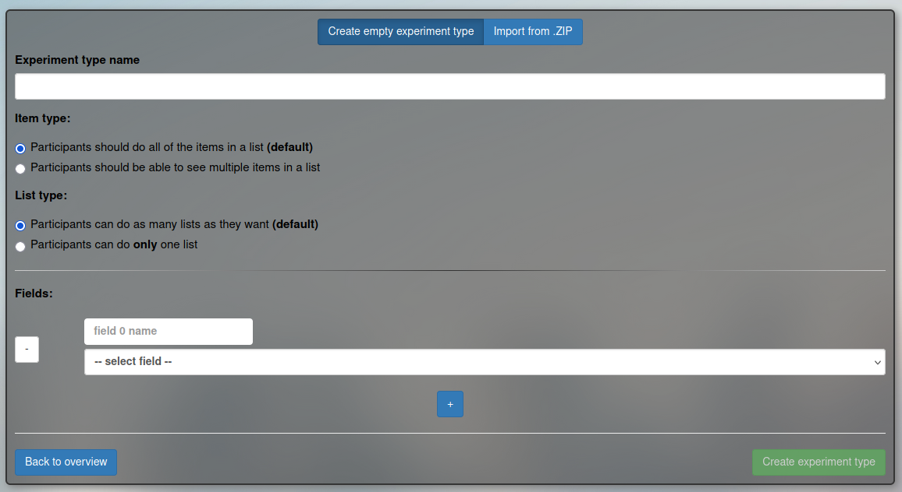
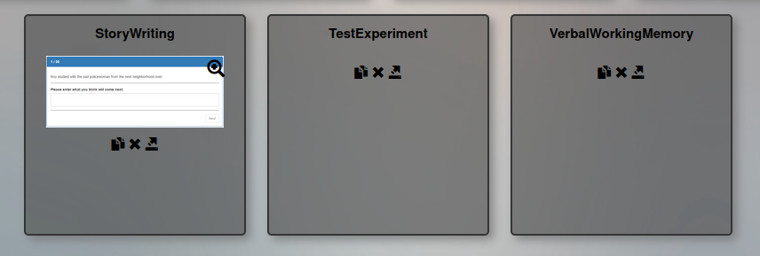
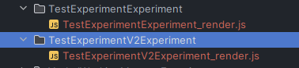
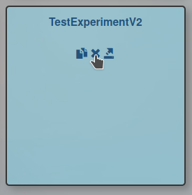

# Creating and Deleting Experiment Types

There are three ways to create a new experiment type.
1. Manual creation
2. By copying an existing experiment type
3. By importing a .zip file

This section will cover the first two options. 
The Zip import option will be covered in the next section.

### Manual Creation

This method will start create a totally minimal experiment, 
with all the required files and starter code.

- Click on “Create Experiment”
- Click on “Create new experiment type”

- Give your experiment type a name and at least one field and field-data-type.
- Click on “Create experiment type” and you will be returned to the landing page.
- If you are doing this locally, then the lingoturk/ folder should have been updated with the necessary files to start working on this experiment.

### Copying Existing Experiment

If you need to add more data fields to an experiment type in the future, 
this option will allow you to copy all existing code over into a new experiment
type.

This is a great option for when only small changes are required to mold one 
experiment set up into another. Use the existing experiment type as a spring
board to create a new one.

- Click “create Experiment”

- Find the experiment you want to copy, this example will use a newly created experiment type called “TestExperiment”
- Click on the copy button under “TestExperiment”
- Give the new experiment a name. This example will use “TestExperimentV2”
- Add or remove experiment fields for the new experiment type

- Hit “Submit” to create the new experiment type. You can create a new instance of it now.
- Similarly to creating the experiment type manually, the files required for the experiments 
can be easily accessible in your local code folder.

### Deleting an Experiment Type

> only do this on your local machine. And if you are doing it on masses, 
> only do it to Experiment Types that you created and are no longer used.
> if you're unsure, it's best to leave it alone.

Deleting an experiment type will remove all associated files from the server. 
So if you still need any part of the code after deletion, it is best to back 
the experiment type up in a zip file (see CH5. Importing Local Experiment 
into Masses), or version control the code with git. Once an experiment 
type has been deleted, there is no going back.

Naturally, deleting an experiment type will also delete all associated instances of it.

- Click “Create experiment”
- Find the experiment type you want to delete
- Press the x button and confirm the pop up prompt.

