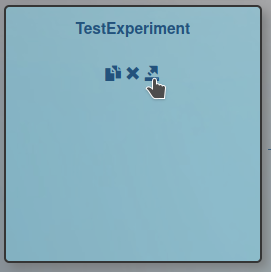
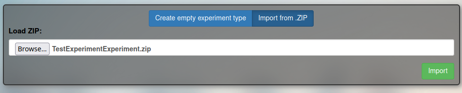

# Importing Local Experiment into Masses

When you are done testing your experiment locally and would like to
share it (via a link) with someone else, you need to export the Experiment 
Type from your local Lingoturk server and upload it to the Masses server. 
This process also works in reverse – if you want to import an experiment 
from Masses to your local machine.

### Exporting The Experiment into a ZIP file
1. Click “Create experiment”
2. Find your experiment and click on the export button

3. Confirm you want to export and a .zip file should be saved to your local machine
4. The ZIP file contains all code that are involved in creating the experiment. 
You can check what files are included by unzipping the .zip file.

### Importing to Another Server
1. Click “Create experiment”
2. Click “Create new experiment type”
3. Select the “Import from .ZIP” option (blue button)
4. Select the .zip file that was downloaded

5. Click “Import” to import the new Experiment Type to another server
6. If doing this on a local machine, like creating an empty Experiment Type, the code files will be updated and you can make changes to them locally.

> NOTE: media like images and audio must be placed in specifically places 
> and may not be properly exported when moving Experiment Types. 
> If working locally, double check the paths and locations of the 
> experiment’s media. The process for uploading media to Masses 
> also requires additional steps (see CH6: Working With Media).