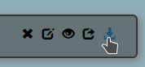
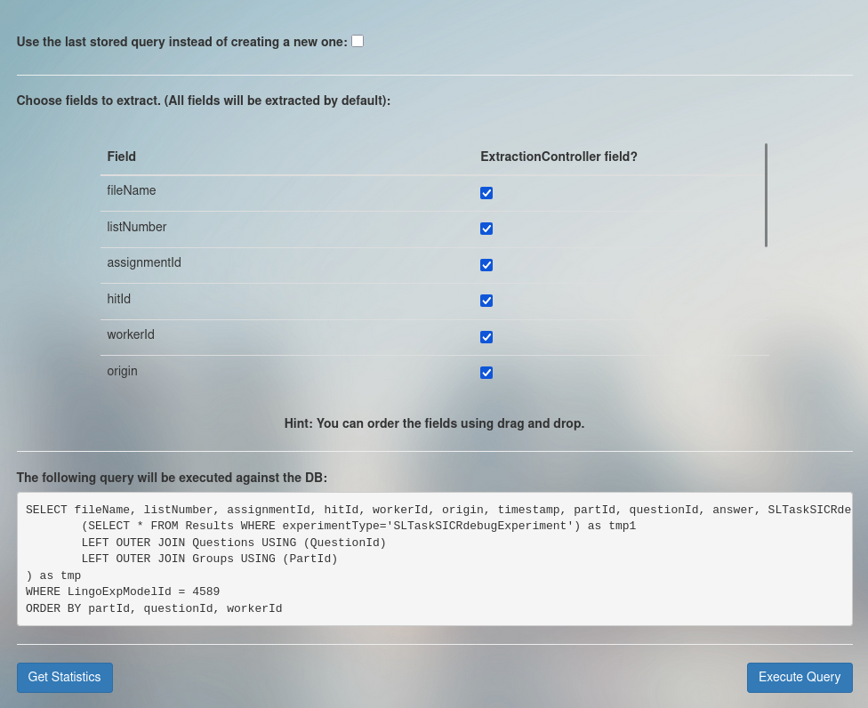
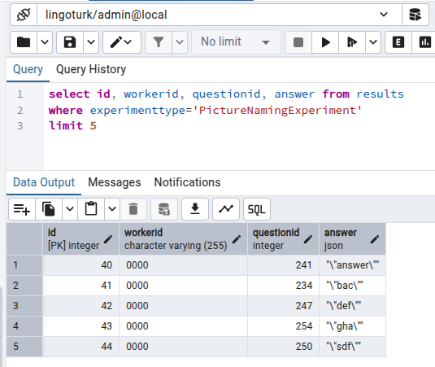

# Querying Results

To get the results of an experiment that you are testing:
- go to “Manage existing experiments”
- find your Experiment Instance
- click the download results button

- select all the data fields you need and press “Execute Query”

- the results should download as a .csv file

### pgadmin

If you have pgadmin installed and are running local tests to
make sure the participant's answers are correctly being written to the database, 
you can simply query your local database manually without downloading 
the files every time. Using the DB instead of the UI speeds up work quite 
a bit in this phase of debugging. 

The output query in the download results screen 
is a good place to start if you plan on running your own queries.

In this example, a local test of the Picture Naming experiment was run
and fully completed and submitted. A quick query in pgadmin was able to confirm
that the responses were recorded in the database correctly.
