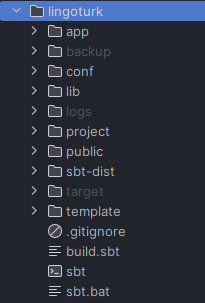

# LingoTurk Set Up
Every researcher has access to two instances of LingoTurk, one offline and 
one online.
1. Masses (link: https://masses.coli.uni-saarland.de:8080/) is shared by 
everyone working at the lab. Any changes made here can be seen by everyone. 
This LingoTurk instance allows the researcher to host their experiment and
generates a link that can be publically shared with anyone in the world, 
letting anyone generate responses. Work on this instance is focused on 
thoroughly testing the experiment before spending money on hiring real 
participants.

2. Local (likely: http://localhost:9000) is your local development environment. 
The server is hosted on your machine and can be started/stopped at any point. 
Completely dependent on files on your local machine. This LingoTurk instance 
is where researchers should begin when creating new experiments and debugging 
problems.

### 1.1 Installation:
Installation link: 
https://github.com/FlorianPusse/Lingoturk/wiki#welcome-to-the-lingoturk-wiki

Clone the repository and follow the installation steps from this link to get 
Lingoturk up and running on your own machine. This will provide everything 
required for local development.

What you should have after installation:
- cloned Lingoturk repository, with a lingoturk/ folder

- working pgadmin

### 1.2 Running Local Lingoturk
- Navigate to the “lingoturk” directory, with files sbt and sbt.bat.
- run `sbt run` to start your local server
- navigate to http://localhost:9000 to see the login screen
- use Admin:admin to access the main landing page