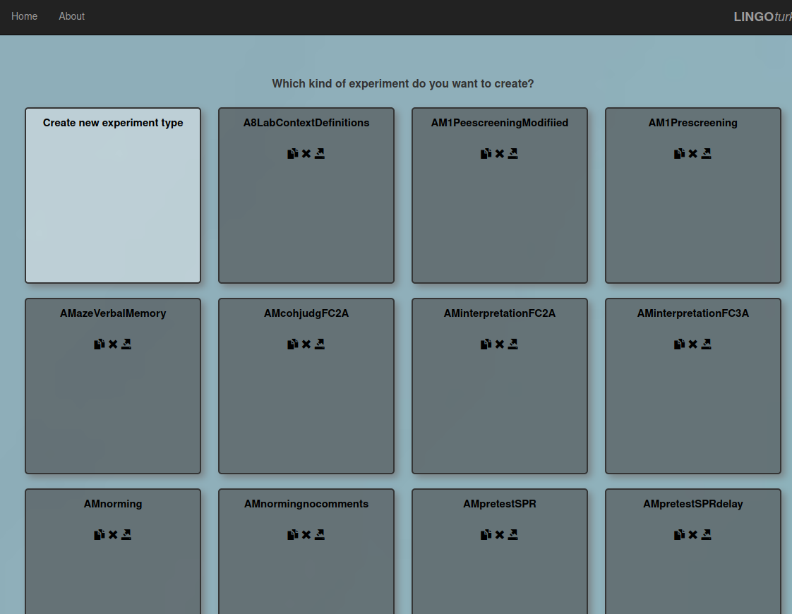
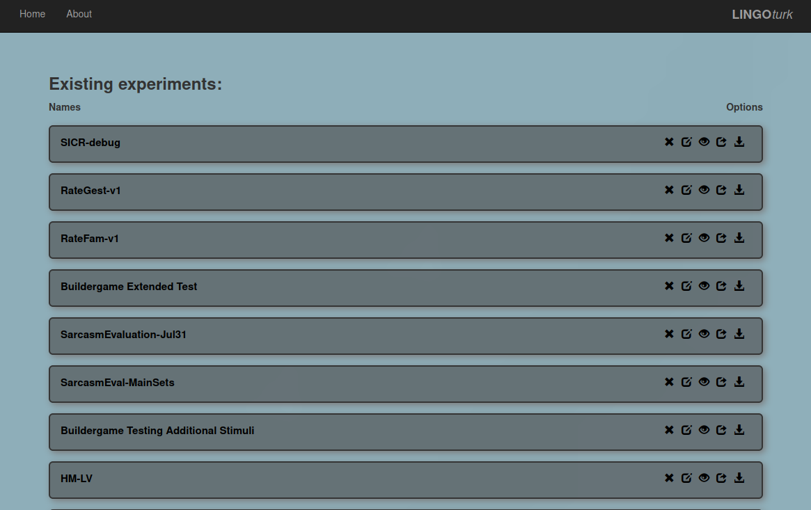

# LingoTurk Overview
This section will cover the basics of how Lingoturk functions.

### 2.1 Experiment Instance vs Experiment Type

Experiment Type defines what a participant will see, what media is used, 
and what results are recorded. It contains all the predefined javascript, 
HTML, and CSS files that are used to create the user interface. You can 
see a list of all experiment types by clicking the “Create Experiment” 
button from the LingoTurk landing page. By clicking on an existing 
experiment type (i.e. anything other than the “Create new experiment type” 
button), you create an experiment instance.

Experiment Instances are individual _instances_ of the experiment types. 
From the Lingoturk landing page, click on “Manage existing experiments” 
to see all current experiment instances on the server. Multiple instances of 
the same experiment type can exist. These may be denoted in a number of ways 
on Masses: through version numbers, dates, and/or researcher names. 

### 2.2 Important Files

In the LingoTurk code repository, these are the major folders that will be 
of importance during development. It is very unlikely that you will need to 
touch anything else in the codebase.

1. app/views/ExperimentRendering/{your-experiment-name}/
    - contains the HTML file that defines the general UI for the experiment
2. public/javascripts/ExperimentRendering/{your-experiment-name}/
    - contains the .js file that will handle the logic for everything in the experiment
3. public/stylesheets/ExperimentRendering/{your-experiment-name}/
    - contains the .css file that will be used by the experiment UI

### 2.3 Media Files
while not as important during development, because you can hardcode 
filepaths anywhere when working locally, pictures and audio paths will 
need to be uploaded to these folders when working on Masses. 
(see CH6. Working With Media)
1. public/audio/Experiments/{your-experiment-name}/ 
2. public/images/Experiments/{your-experiment-name}/ 

**Summary**: a single experiment type consists mainly of 1 .html, 
1 .css, and 1 .js file, plus any additional media (i.e. anything 
that is not text or generated by code) the experiment requires.

### 2.4 Workflow
A typical workflow during development looks like this.

- **On Local Machine:**
1. Create Experiment Type – this will create the files in your lingoturk repository
2. Create Experiment Instance and publish to Prolific (should provide localhost URL)
3. Make changes to the .js, .html, .css files
4. Go to Prolific link and test the experiment
5. Repeat 3-4 as many times as you need (note: any code changes will take effect when you refresh the page, do not need to recreate new instances or republish to Prolific when developing locally)
6. Export to Masses when ready (see CH5. Importing Local Experiment into Masses)

> Note: the only times a new instance is required is if switching to a 
> different set of experimental materials (in the .csv file) or if additional 
> experimental materials are being used. however, if adding a new field or 
> new data columns that need to be used by the code, an entirely new experiment
> type is required with those new columns properly defined.

- **On Masses** 
(hopefully, once on Masses, the changes will be relatively minor)
1. Any changes should be made locally, with the experiment type re-exported to
Masses, and a new instance created and published. Since this is significantly 
more work than working on a local Lingoturk, it is recommended that the majority
of your work should be done offline.
