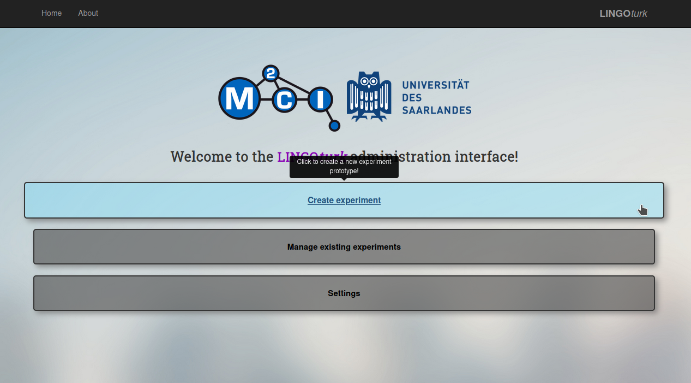
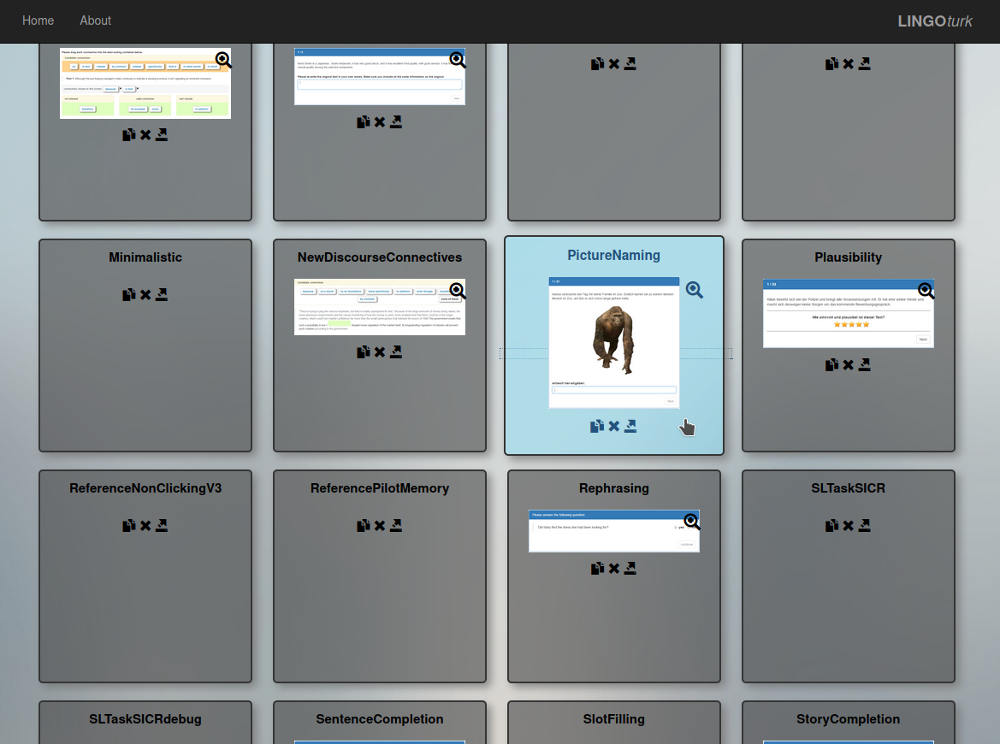
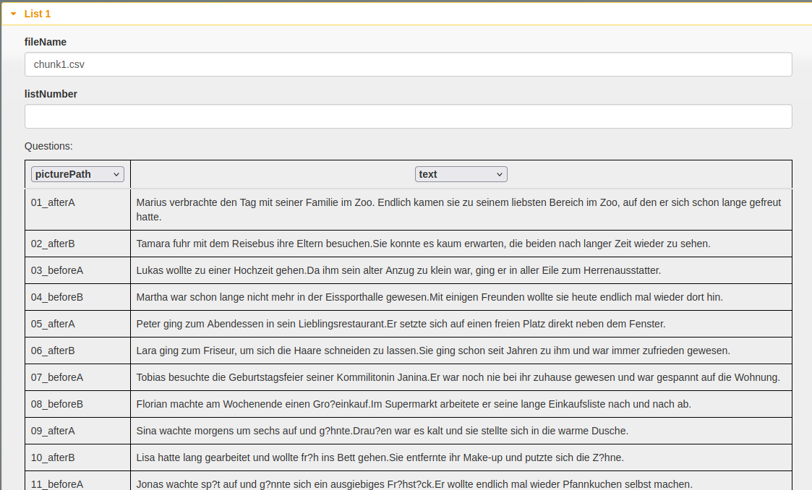
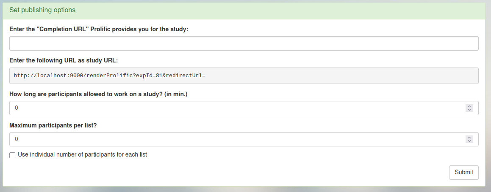
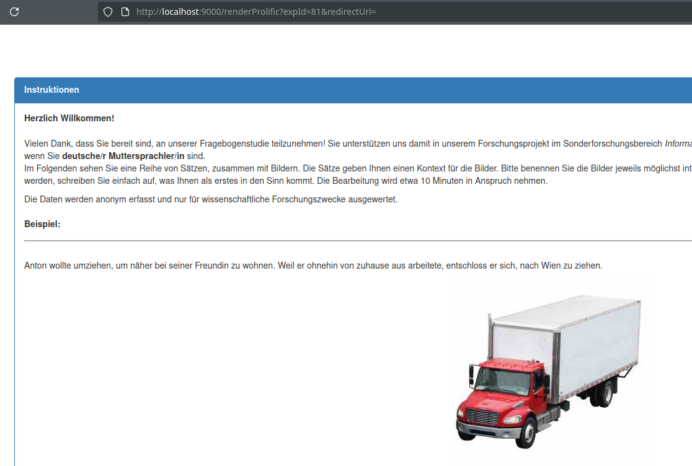
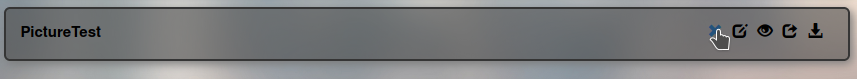

# Creating/Deleting and Running an Experiment Instance

This section will give step-by-step instructions for creating a local 
instance instance of the PictureNaming experiment. This should have 
come pre-loaded in the lingoturk repository, and should be showing in the 
LingoTurk experiment types list. There should also be a folder called 
“example input data” that’s in the top level of the cloned lingoturk repository.

**1. Create Experiment**



**2. Choose the experiment – this example uses PictureNaming**



**3. Load the necessary information: Name and Data**
- For name: this can be anything. Use a date, name, version number, etc., 
to distinguish it from anyone else’s instances.

- For data: navigate to the “Experimental materials” tab and select “load .csv”.
Every experiment will have a .csv file to go along with it. This file contains
all the experimental materials. In this example, we will use the file 
“example input data/Picture Naming Experiment/chunk1.csv”. 


> before we finish creating the instance, we need to ensure two things are correct:
> 1. we’re using the correct .csv delimiter. for this example, change the 
> delimiter at the bottom of the page from a comma to a tab. 
> the table should reflect that change immediately and correctly display the data.
> 2. the columns are labeled with the proper field names (drop down menus)



- once the data fields are properly aligned, click “Save in Database” to 
finalize the instance. You should be redirected to the landing page.

> NOTE: the specified fields are written to a sql database in this step, 
> you can see what the data looks like in the questions table.
> ```
> select * from questions
> where experimenttype='PictureNamingExperiment'
> ```


**4. Publishing the Experiment**
- Click on “Manage existing experiments” and find the experiment name that was just created.
- Click on the “publish experiment” button
- Select “Prolific Academic”
- A working URL will be provided. If on Masses, this URL can be accessed by 
anyone with the link. If locally, it will be a localhost URL.



- Visit the link and the experiment is available for testing.



**5. Deleting an Instance**

If you need to delete the instance for any reason, e.g. clean up of test 
experiments. Double check the name before deletion. If on Masses, 
**DO NOT** touch the experiments that you are not working on.

Deleting instances will will remove all the experimental materials 
(defined by .csv files) that were loaded upon creation. 
However, it will not delete the results from previous test submissions.

- Click on “Manage existing experiments”
- Find your experiment
- Click the x button and confirm 


