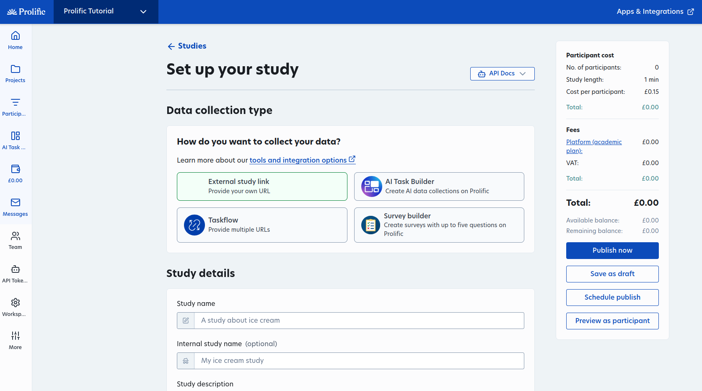
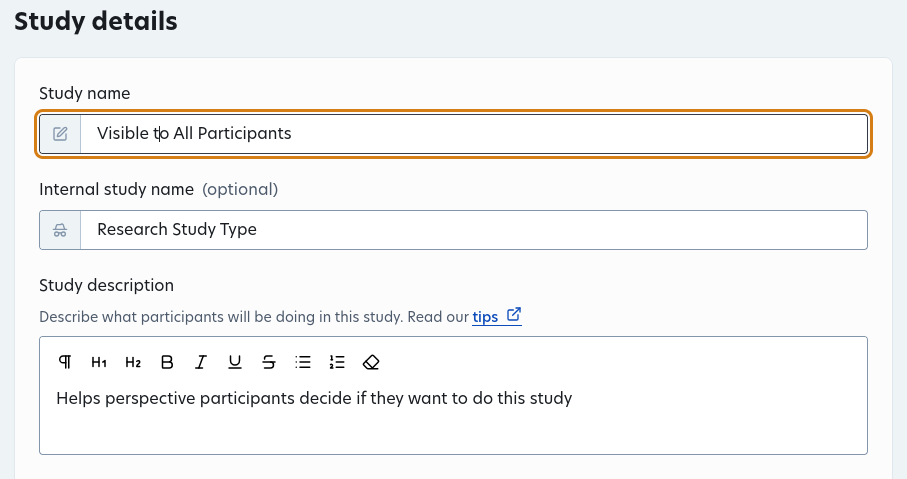
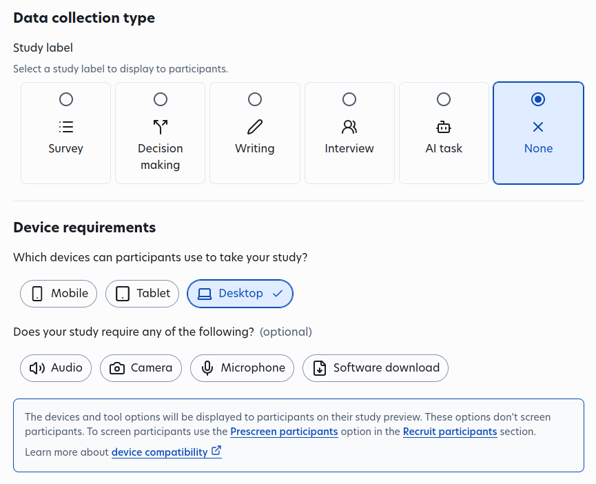
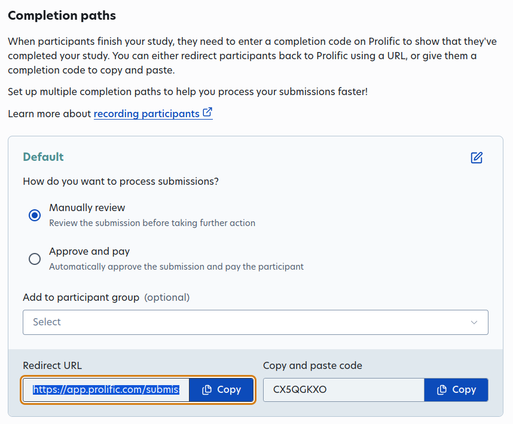
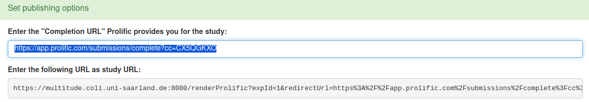
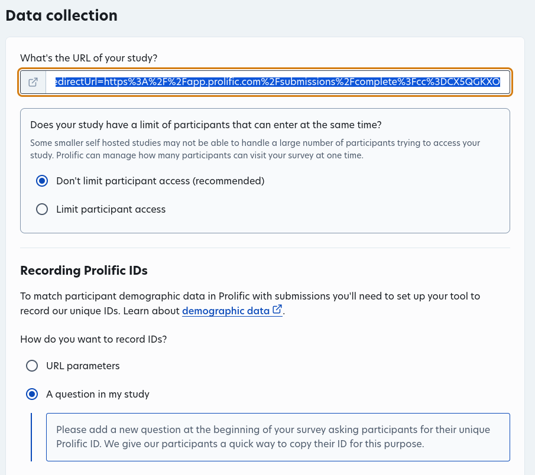
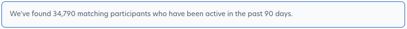

# Study Options and Setup

Once you have your workspaces and projects set up, you will create a Study to actually
run your experiments. 

## Set up your study

This is what you should see when you click on "New Study". 
We will go over everything on this page that pertains to the setup and
details of the study itself.

Anything related to costs and monetary values will be covered in the next 
documentation page. This includes the floating box on the right side of the screen
as well as the cost options at the very bottom of the page.

### Data Collection Type

Make sure to select "External study link".

### Study Details

**Name**

Note that there is a public facing name and an optional internal facing name.
The "Study Name" should be somewhat generic, so that the participants do not
know what the experiment is trying to study.

Of course, the description should also be slightly vague in order to not give
any critical information away to the participants.

**Device Requirements**

It is best practice to ensure that the participants are doing the experiment on 
a computer or laptop. Mobile and Tablet are always autoselected in a new study, 
so unselect those before continuing.

If your experiment needs to play or record audio, this is where you would
specify it as well.

### Data Collection

The URL of the study will be a Multitude link. However, there are a couple of steps
in order to generate this URL.

1. Copy the redirect link Prolific provides you in the Data Collection tab 

2. Paste the redirect link back in your Multitude Experiment Instance publishing options
This will immediately update the study URL underneath the text box. 

3. Copy the multitude.coli.uni-saarland.de study URL (this is the URL you normally send
to people for pretesting) with the newly attached Prolific redirect URL. Go back to Prolific
and paste it into the "What's the URL of your study" text box.

4. Once the URL is filled out, a couple of new options will appear. We don't normally
limit participant access. And since we record IDs in Lingoturk with a workerID slide,
select the "A question in my study" option for the Recording Prolific IDs.

At this point, you can preview the study by clicking the "Preview as participant" button 
located in the floating box on the right side of the screen. This should look 
exactly like any testing you did on Lingoturk itself. 

### Recruit Participants
Here are some common options used when running experiments on Prolific:

**Source**: Select "Find new participants on Prolific"

**Participants**: more on this later in next section

**Credentials**: Select "No"

**Screening**: Select "Choose new Screeners" and the **Prescreen Participants** 
section will appear

**Location**: Study dependent

**Study Distribution**: Select "Standard sample"

**Prescreen Participants**: Make sure "Choose new Screeners" is selected above.

There are a lot of options here to consider when running your experiment. This can be
very study specific, but there are a few options that are almost always on:

1. Approval Rate: 95 - 100. This is the rating for the participant, so we normally keep
this value above 95 to ensure good results.
2. Number of previous submissions: 100 - 100000. This is how many previous studies the
participant has been a part of.

> An example screener: a study on native English listener ratings of nonnative speech. 
> 
> Fluent languages: English
> First language: English
> Nationality: United States
> Place of most time spent before turning 18: United States
> Bilingual: none just my native language

Screener will limit the number of available participants. Prolific will give you an
estimate of how many users actually fit your requirements. Make sure this number is
at least above a few thousand for speedy data collection. 

**Submissions**: Select "Once"

**Reject exceptionally fast submissions**: Select "No"
