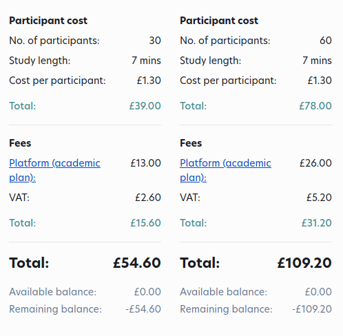

# Figuring Costs

There are three settings that control how much a study will cost:
1. Experiment Completion Time
2. Payment Rates
3. Number of Participants

### Experiment Completion Time

When testing your experiment within the lab or locally, ask people to record how long it 
took them to finish the entirety of the experiment. Taking an average and adding a 
couple of extra minutes to the average is a good estimate of the completition time.

### Payment Rates

The box in Prolific is amount we are paying to each participant for completing the study.
Most likely, you will need to calculate this for each study depending on the amount of 
time each study roughly takes to complete.

> NOTE: the value in this box is in pound sterling, NOT in Euros. 
> 
> Search for an EUR->GBP convertion rate online.

To calculate this number, we take an hourly wage, convert to GBP, multiply it by
minutes for completion and divide by 60. 

> NOTE: We pay the German minimum wage. 
> Even if we are recruiting participants from another country.
>
> You can find this by searching "Minimum wage Germany {YEAR}". 

Example: for a 7 minute experiment in 2025

    12.82EUR/HR * 0.87GBP/1EUR * 7min * 1hr/60min = 1.301GBP
    Enter 1.30 GBP into the box.

### Number of Participants

The number of participants will determine the final costs for your experiment. 
Once your completion time and payment rates have been filled in, Prolific will provide
an estimate for how much your study will cost in the floating box on the right side
of the screen. 

It is important to note that Prolific charges a variable platform fee on top of the payment
to each participant. This value will change depending on the number of participants 
in your study. So, you cannot just calculate the total amount for different number
of participants with a spreadsheet. Unfortunately, if you want to see how much it costs 
to run a study with 30 vs. 60 participants, you have to manually update the 
number of participants and see the price change on the website. You cannot assume a doubling
of price.

Here is a comparison of prices for 30 vs. 60 participants for a 7 minute experiment: 

