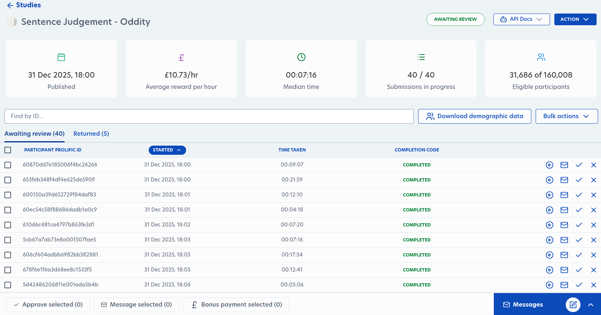

# Publishing the Study

In order to publish the study, you need to add money to your account.
Without money in your account, most of the publication options are unavailable
to you. Reach out and talk to your advisor for help with this step. 

A potential worry is accidentally publishing before you are ready - thankfully, both
the "Publish Now" and "Schedule publish" buttons will have 2 dialog boxes that allow you
to review the study parameters before confirming and starting the crowdsource process.

## Preview as Participant

After providing a Multitude link to your study, the option to preview your study
becomes available. This will be an exact look at what your participants will see. 
It is the final QA step before publication and is extremely recommended as a final
sanity check before publication. 

In fact, since it is just a redirect to our servers,
you can always use this Preview function during your development cycle. 
The only difference, when compared to a normal Multitude link, is after submitting
your results, you will end up back in Prolific with the screen that participants
will see instead of being redirected to the start of the experiment.

## Schedule Publication

For experiments that need participants from a timezone that's not your own - no
need to hop on at weird hours of the day to run them. Just schedule them for a future
date at a specific time and timezone.

For main experiments, publication time may have an impact on your results. 
So it is best to follow some best practices:
- schedule the study within working hours using furthest West timezone of the 
location you are recruiting participants from. 
> For example, if you are recruiting
> participants from the United States, select either 12PM Eastern or 9AM Pacific time
> zone, to ensure all participants are within business hours.
> (most likely - I am unsure how Prolific handles HI and AK participants)

- avoid holidays and weekends. to make even more sure, avoid Mondays and Fridays as well
and only schedule the study from Tuesday to Thursday.

## Published

Once published, you will not be able to modify most of the details of your study. 
However, you are able to pause or stop the study at any point, even if participants
have started. Once a participant begins a study, there is no kill switch to end their
participation.

Prolific will also show a dashboard instead of the page you used to set up the study.
To go back to the details page and perform any other admin you may want to do, 
click on the blue ACTION drop down menu.

## Review and Payment

After the quota has been reached, you must review and pay the participants.
If this is not completed within 21 days, payments will automatically go through.

TODO: ADD OUR REVIEW PROCESS
