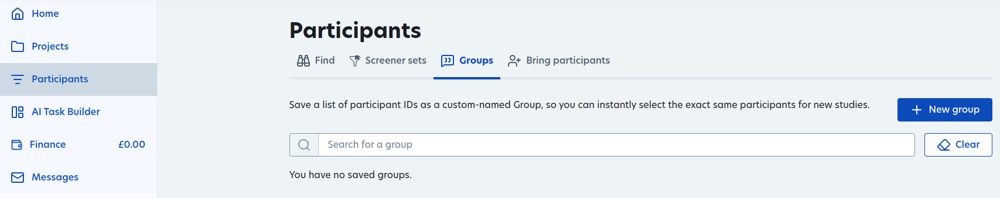
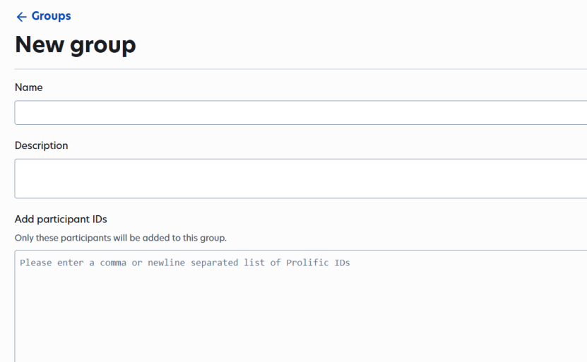
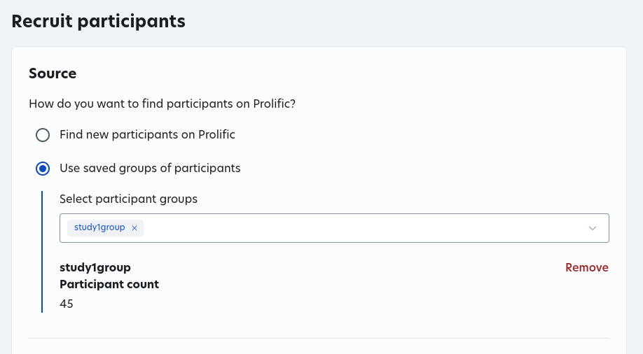
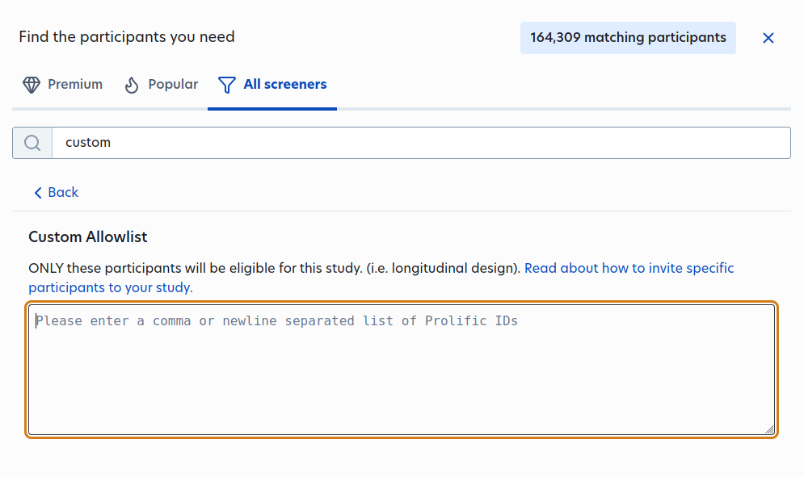
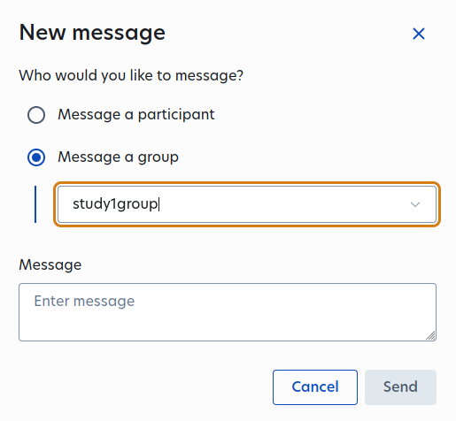

# Longitudinal Studies

After running a first study, you can follow this process to continue with the
same participants.

## Participants
1. Create a group

    
2. Gather the worker IDs of participants who successfully finished
the first study. You can bulk download all of the IDs by downloading demographic
data through Prolific or through the provided participant ID from Multitude's data.
    
3. Copy paste the worker IDs into your new group

    

## New Study
1. Create a new study
2. During study setup, under the "Recruit participants" section, 
select "Use saved groups of participants"
3. Select the group you would like to use

Alternatively, you can use a custom screener to add worker IDs manually.
1. Add new screener
2. Select "Custom Allowlist"
3. Copy & Paste participant IDs

## Messaging First Group
When you start the second study, you can optionally decide to 
send a message to everyone in a group you've created 
to let them know that they can participate in the second study.

